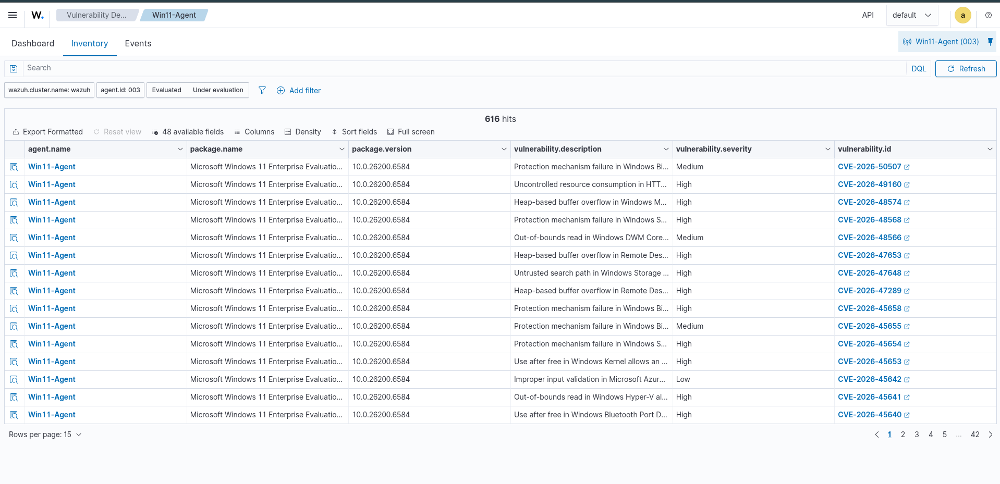
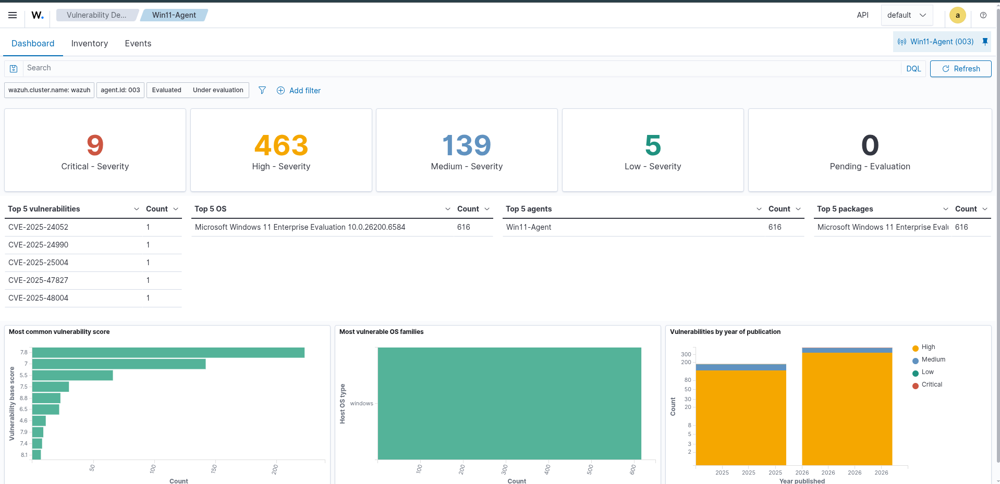
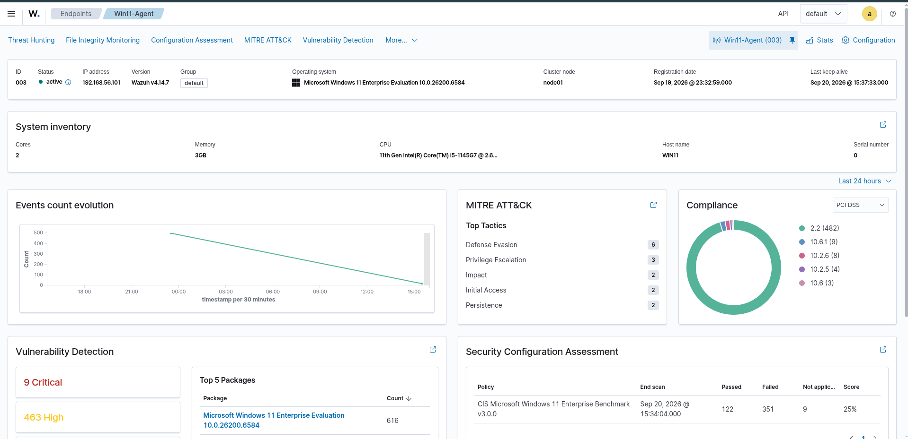
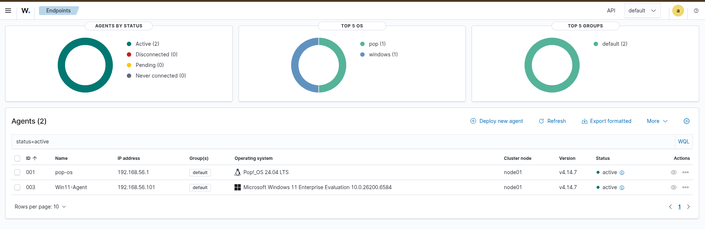
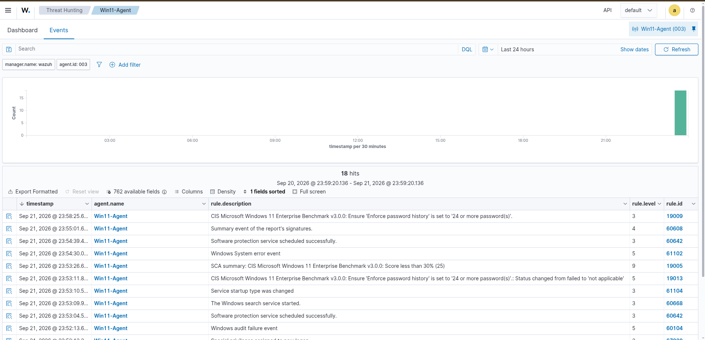
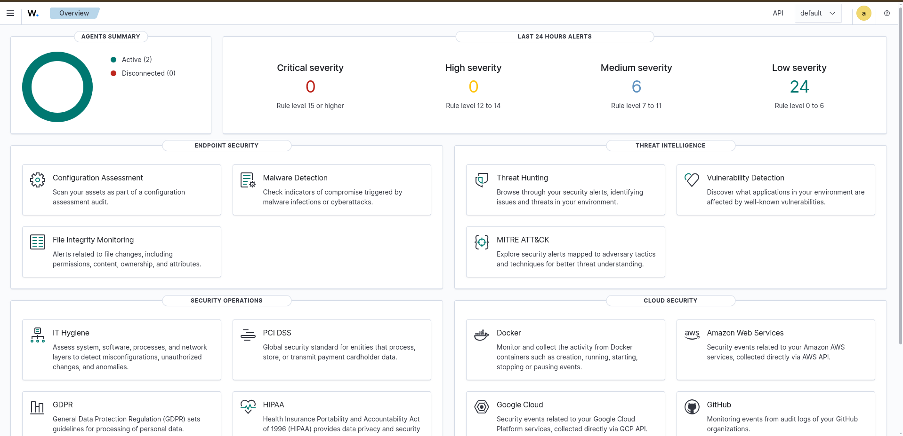
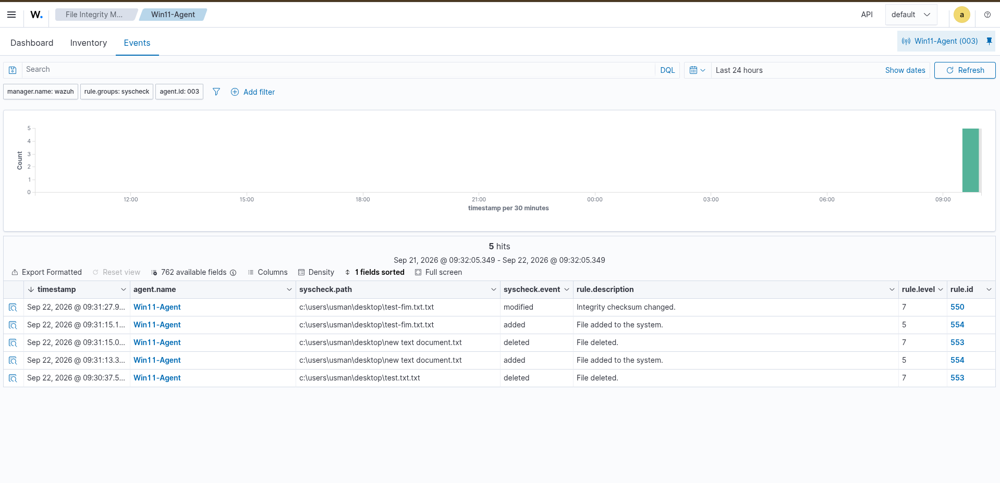

# SOC Home Lab - Wazuh SIEM


## Project Overview

This is a **Blue Team SOC Home Lab** built using **Wazuh** (open-source SIEM/XDR) to gain practical hands-on experience in Security Operations Center (SOC) skills.

The lab simulates a real-world SOC environment with endpoint monitoring, threat detection, file integrity monitoring, and vulnerability detection.

---

## Architecture

```
+---------------------------------------------------------------+
|                        VirtualBox Host                        |
|                                                               |
|  +---------------------------+     +------------------------+ |
|  |   Windows 11 Endpoint     |     |   Ubuntu Server 24.04  | |
|  |   (Win11-Agent)           |     |   Wazuh All-in-One     | |
|  |                           |     |                        | |
|  |  - Wazuh Agent            |     |  - Wazuh Manager       | |
|  |  - Sysmon                 |---->|  - Wazuh Indexer       | |
|  |  - FIM                    |     |  - Wazuh Dashboard     | |
|  |  - Vulnerability Scan     |     |                        | |
|  |                           |     |  IP: 192.168.56.103    | |
|  |  IP: 192.168.56.101       |     |                        | |
|  +---------------------------+     +------------------------+ |
|                                                               |
+---------------------------------------------------------------+
```

**Components:**
- **Wazuh Server** (All-in-One): Manager + Indexer + Dashboard on Ubuntu Server 24.04
- **Windows 11 Endpoint**: Agent + Sysmon for advanced telemetry
- **Network**: Bridged / Host-Only networking for communication between VMs

---

## Features Implemented

| Feature                        | Status      | Description                                      |
|--------------------------------|-------------|--------------------------------------------------|
| Wazuh All-in-One Deployment    | ✅ Completed | Manager + Indexer + Dashboard                    |
| Windows 11 Agent               | ✅ Active   | Successfully enrolled and reporting              |
| Sysmon Integration             | ✅ Working  | Advanced process & network telemetry             |
| File Integrity Monitoring (FIM)| ✅ Working  | Real-time monitoring of Desktop & critical paths |
| Vulnerability Detection        | ✅ Working  | 600+ vulnerabilities detected (including Critical & High) |
| Security Configuration Assessment (SCA) | ✅ Working | CIS Benchmark for Windows 11                     |

---

## Technologies Used

- **Wazuh 4.14** (SIEM / XDR)
- **Sysmon** (SwiftOnSecurity configuration)
- **Ubuntu Server 24.04**
- **Windows 11 Enterprise Evaluation**
- **VirtualBox**
- **MITRE ATT&CK** mapping

---

## Screenshots

### 1. Vulnerability Inventory


### 2. Vulnerability Dashboard


**Summary:** 9 Critical | 463 High | 139 Medium | 5 Low

### 3. Agent Overview


### 4. Agents Status


### 5. Threat Hunting Events


### 6. Main Dashboard


### 7. File Integrity Monitoring (FIM)


---

## Skills Demonstrated

- SIEM deployment and configuration (Wazuh)
- Endpoint detection & response (EDR-like using Sysmon + Wazuh Agent)
- File Integrity Monitoring (FIM)
- Vulnerability Management
- Log analysis and alert triage
- Blue Team / SOC Analyst fundamentals
- Virtualization networking (VirtualBox Bridged Adapter)

---

## Future Improvements (Phase 2)

- [ ] Attack simulation using Atomic Red Team
- [ ] Custom detection rules
- [ ] TheHive + Shuffle (SOAR)
- [ ] Incident Response playbooks
- [ ] More endpoints (Linux agent)

---

## Author

**Usman Shaikh**  
Blue Team | SOC Analyst Aspirant  
GitHub: [Usman-543](https://github.com/Usman-543)

---

## License

This project is for educational and portfolio purposes only.
